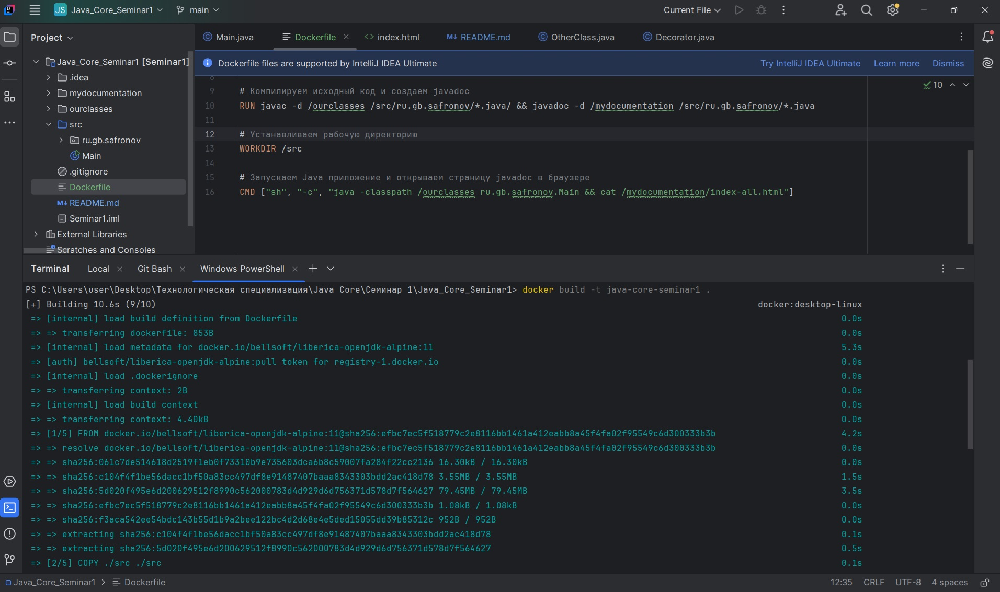
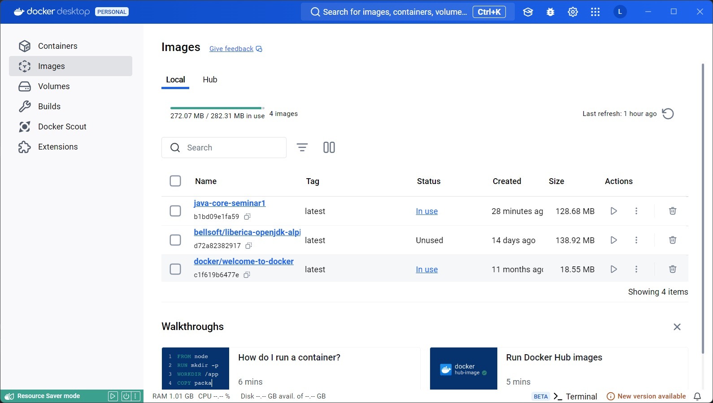
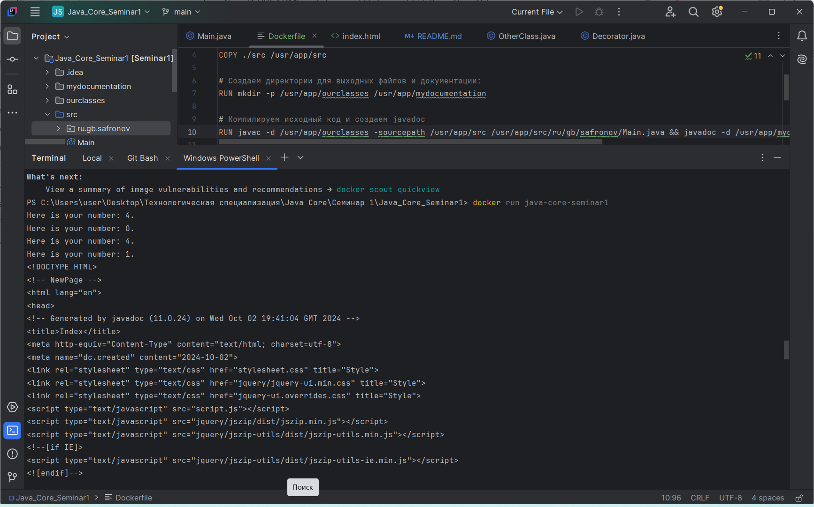
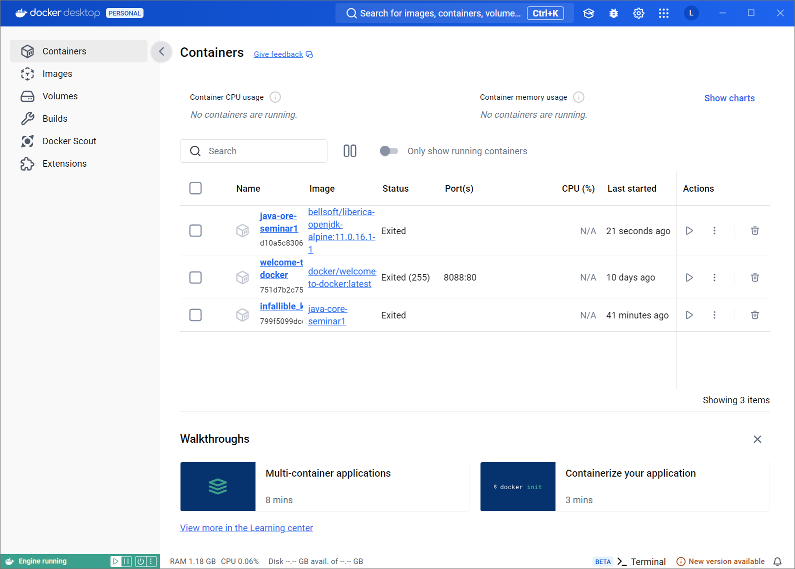

# Java_Core_Seminar1
## Задание 1
Создать, скомпилировать, запустить и продемонстрировать простой проект без
использования среды разработки.
### Решение:

Компиляция с указанием выходной директории (ourclasses):  
javac -d ourclasses ./src/Main.java

Запускаем скомпилированный класс:  
java -cp ./ourclasses/ Main

## Задание 2  
Создать проект из трёх классов (основной с точкой входа и два класса в другом пакете), которые вместе должны составлять одну программу, позволяющую
производить четыре основных математических действия и осуществлять форматированный вывод результатов пользователю.  
Скомпилировать проект, а также создать для этого проекта стандартную вебстраницу с документацией ко всем пакетам.

### Решение:

javac -sourcepath ./src -d ourklasses src/ru/gb/safronov/Main.java -encoding utf-8  

java -cp ./ourclasses/ ru.gb.safronov.Main 

javadoc -d mydocumentation -sourcepath ./src -cp ./ourclasses/ -subpackages ru -encoding utf-8

## Задание 3
Создать docker-контейнер для формирования полной документации по проекту

### Решение:
1. Создаем в папке проекта Dockerfile:

// Исходный образ:  
FROM bellsoft/liberica-openjdk-alpine:11

// Копируем исходный код из папки src проекта внутрь образа:   
COPY ./src /usr/app/src

// Создаем директории для выходных файлов и документации:   
RUN mkdir -p /usr/app/ourclasses /usr/app/mydocumentation

// Компилируем исходный код и создаем javadoc:   
RUN javac -d /usr/app/ourclasses -sourcepath /usr/app/src /usr/app/src/ru/gb/safronov/Main.java && javadoc -d /usr/app/mydocumentation /usr/app/src/ru/gb/safronov/Main.java

// Устанавливаем рабочую директорию:   
WORKDIR /usr/app

// Запускаем Java приложение и открываем страницу javadoc в браузере:   
CMD ["sh", "-c", "java -classpath /usr/app/ourclasses ru.gb.safronov.Main && cat /usr/app/mydocumentation/index-all.html"]

2. Собираем образ:   
docker build -t java-core-seminar1 .

3.  Запускаем контейнер:   
docker run java-core-seminar1

4. Проверяем и запускаем в браузере index-all.html:

